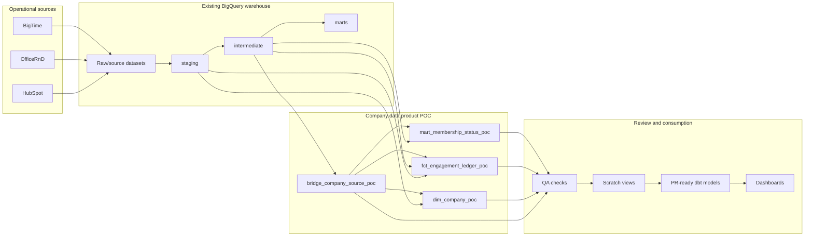
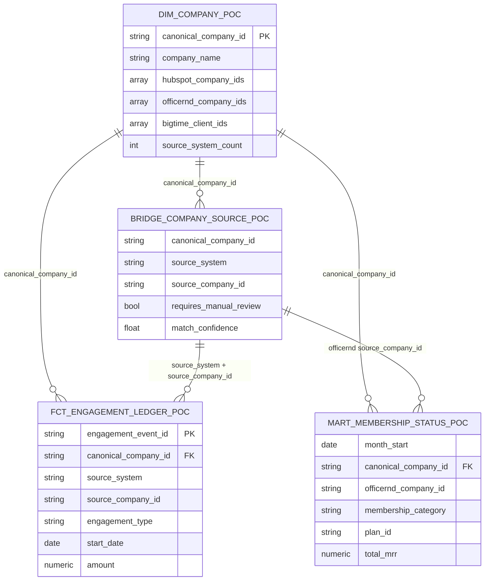

# Newlab Centralized Company Data Product Design

## Executive Summary

Newlab needs a consistent company-level data product that connects company identity, membership activity, CRM opportunity data, and services/project engagement across the warehouse. The proposed MVP does this by building on the warehouse structures that already exist in BigQuery, especially `intermediate.int_cross_source_companies` and the existing membership detail/monthly models.

The design introduces four read-only POC models:

| Model | Purpose | Grain | Primary key |
|---|---|---|---|
| `bridge_company_source_poc` | Preserves source-system company mappings to canonical company IDs. | One row per canonical company / source system / source company ID. | `canonical_company_id`, `source_system`, `source_company_id` |
| `dim_company_poc` | Provides one display/convenience row per canonical company. | One row per non-null canonical company ID. | `canonical_company_id` |
| `fct_engagement_ledger_poc` | Consolidates company-facing engagement events. | One row per deterministic engagement event. | `engagement_event_id` |
| `mart_membership_status_poc` | Provides current/past monthly membership status reporting. | One row per month / OfficeRnD company / location / membership category / plan. | `month_start`, `officernd_company_id`, `location_id`, `membership_category`, `plan_id` |

This is intentionally not a replacement of the current warehouse. It is a thin product layer on top of trusted staging, intermediate, and mart assets, designed to be reviewed, tested, and promoted into scratch views or dbt models after decisions are confirmed.

## Business Problem

Company data currently exists across multiple operational systems:

- HubSpot for CRM companies, deals, and commercial pipeline.
- OfficeRnD for members, companies, contracts, memberships, and locations.
- BigTime for clients and project work.

Without a centralized company product, analytics work must repeatedly solve the same problems:

- Which HubSpot, OfficeRnD, and BigTime records represent the same real-world company?
- Which source IDs should be used for drill-through and audit?
- Which engagement signals should be visible at company level?
- How should membership status reconcile to the existing production mart?
- Which records are unresolved, manually reviewed, or lower-confidence matches?

The MVP addresses these questions by separating identity resolution, display attributes, engagement facts, and membership marts into explicit models with QA flags preserved.

## Current Warehouse Architecture

The current BigQuery warehouse already has the right foundation:

- Source/raw datasets: `hubspot`, `prod_officernd_raw`, `prod_bigtime_raw`
- Curated source layer: `staging`
- Cross-source business logic: `intermediate`
- Existing reporting marts: `marts`

The strongest existing assets for this work are:

- `intermediate.int_cross_source_companies`: canonical company mapping across systems.
- `intermediate.int_membership_detail`: membership/resource/period detail.
- `intermediate.int_membership_months`: monthly expansion of membership detail.
- `marts.mart_membership_detail`: existing membership mart used for reconciliation.

## Proposed Architecture

## Why Build On The Existing Warehouse

This design intentionally builds on the existing warehouse rather than replacing it because:

- The warehouse already has curated staging models for the source systems.
- The cross-source company mapping already exists and has been validated as the correct identity foundation.
- The membership spine already reconciles to `marts.mart_membership_detail` when category normalization is applied.
- Reusing existing layers reduces implementation risk and avoids competing definitions of membership, source company, and canonical company.
- The POC can be promoted incrementally: first as read-only SELECTs, then scratch views, then dbt models with tests and documentation.

The major architectural choice is to make `bridge_company_source_poc` the source of truth for mappings. `dim_company_poc` is intentionally a convenience table and should not be used to replace source-system join logic.

## Model Relationships

## Canonical Company Strategy

The canonical strategy has three principles:

1. Preserve source IDs. Multiple source company IDs per canonical company are real and must remain visible.
2. Separate mapping truth from display attributes. The bridge governs identity; the dimension provides convenient display fields.
3. Surface mapping quality in downstream facts and marts. Null canonical IDs, manual-review flags, and match confidence should be available to every consumer.

For `dim_company_poc`, representative display records are deterministic:

- HubSpot is preferred first for company name, domain, and industry.
- OfficeRnD prefers `company_status = 'active'`, then latest `modified_at`, then deterministic name and ID ordering.
- BigTime prefers non-deleted/current client rows when available. The current POC uses the available `is_deleted` signal, then deterministic name and ID ordering.

These representative fields are for display and convenience only.

## Data Quality Strategy

The MVP data-quality approach is to expose risks rather than hide them:

- Keep unmatched source companies in the bridge.
- Exclude null canonical IDs from the dimension, but retain null flags in facts and marts.
- Carry `requires_manual_review` and `match_confidence` downstream.
- Preserve all source IDs in arrays on the dimension.
- Normalize `membership_category` with `COALESCE(membership_category, 'Uncategorized')` to reconcile membership reporting.
- Use deterministic event IDs in the engagement ledger and validate no duplicates.

Key QA results from the POC:

- Duplicate `source_system / source_company_id` mappings: 0 duplicate groups.
- Multiple source IDs per canonical/source: 61 groups affecting 189 source IDs.
- Engagement ledger duplicate event IDs: 0.
- Membership status reconciliation to `marts.mart_membership_detail`: exact after membership category normalization.

## Known Limitations

- The POC does not yet include HubSpot activities such as emails, calls, meetings, notes, or tasks.
- HubSpot deal-company logic uses only the primary company association: `HUBSPOT_DEFINED` / `type_id = 5`.
- OfficeRnD membership facts are membership/resource/period rows, not simple membership headers.
- Future contracted membership months are excluded from the default membership status mart.
- BigTime status normalization is currently based on `is_inactive`; richer project lifecycle logic can be added later.
- Representative attributes in `dim_company_poc` can obscure source-level variation if used without the bridge.

## Review Decisions Needed

Before creating scratch views or PR-ready dbt models, the review owner should confirm:

1. Whether unmatched source companies should remain out of the dimension but visible in bridge and fact QA.
2. Whether the engagement ledger should remain limited to deals, memberships, and projects for MVP.
3. Whether HubSpot primary company association `type_id = 5` is the correct deal-company rule.
4. Whether future membership months should become a separate future-bookings mart.
5. Where scratch views should live and what naming convention should be used.

