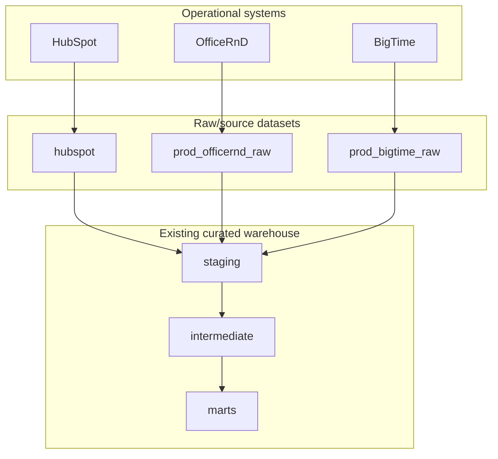
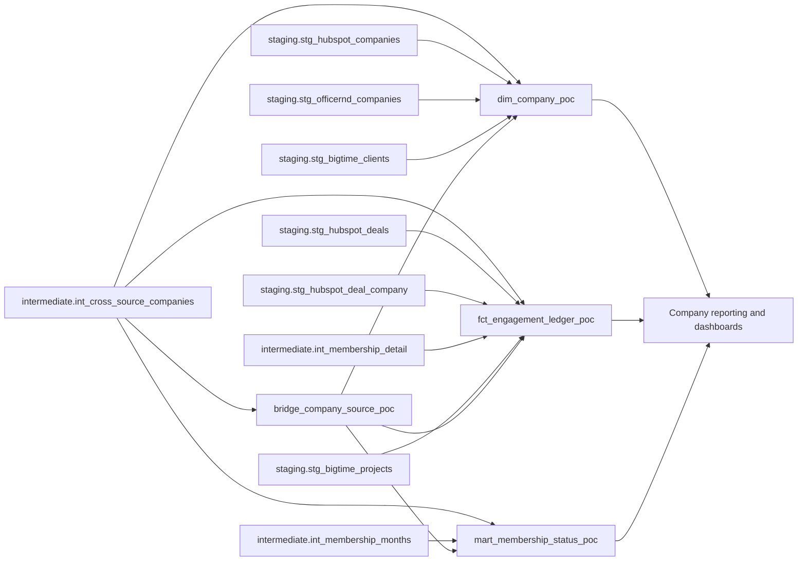
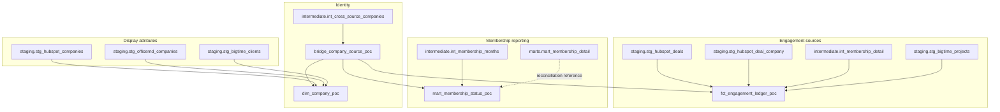
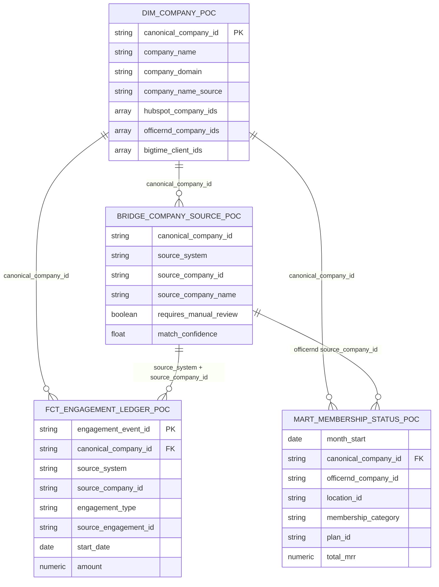

# Newlab Company Data Product Architecture

## Executive Summary

The proposed Newlab company data product creates a canonical company layer across HubSpot, OfficeRnD, and BigTime without replacing the existing warehouse. It uses the warehouse's current staging, intermediate, and mart layers as trusted inputs and adds four reviewable POC models:

- `bridge_company_source_poc`
- `dim_company_poc`
- `fct_engagement_ledger_poc`
- `mart_membership_status_poc`

The design separates identity resolution from display attributes and reporting metrics. This lets analysts join facts to a canonical company while still preserving every source-system company ID needed for audit, drill-through, and remediation.

## Business Problem Being Solved

Newlab needs a consistent way to answer company-centered questions across systems:

- Which companies are active members?
- Which companies have HubSpot deals?
- Which companies have BigTime projects?
- Which source records roll up to the same real-world company?
- Which company mappings are null, low confidence, or manually reviewed?
- How do membership metrics reconcile to the existing membership mart?

Today, those answers require repeated source-specific joins and ad hoc identity logic. The proposed product standardizes the company identity and engagement layer while preserving the existing warehouse semantics.

## Current Warehouse Architecture

Current warehouse assets used by this design:

| Layer | Asset | Role in design |
|---|---|---|
| `staging` | `stg_hubspot_companies` | HubSpot display attributes. |
| `staging` | `stg_hubspot_deals` | HubSpot commercial engagement events. |
| `staging` | `stg_hubspot_deal_company` | Primary company association for deals. |
| `staging` | `stg_officernd_companies` | OfficeRnD display attributes and company status. |
| `staging` | `stg_bigtime_clients` | BigTime client display attributes. |
| `staging` | `stg_bigtime_projects` | BigTime project engagement events. |
| `intermediate` | `int_cross_source_companies` | Canonical company mapping foundation. |
| `intermediate` | `int_membership_detail` | OfficeRnD membership detail for engagement ledger. |
| `intermediate` | `int_membership_months` | Monthly membership spine for status mart. |
| `marts` | `mart_membership_detail` | Existing mart used for reconciliation. |

## Proposed Architecture

The four POC models form a small semantic layer:

- The bridge preserves company identity mappings.
- The dimension provides one row per canonical company for user-friendly joins and display.
- The engagement ledger consolidates company-facing activity from selected systems.
- The membership mart provides reconciled monthly membership status.

## Data Lineage

## Entity Relationships

## Why This Design Builds On The Existing Warehouse

The existing warehouse already contains source cleanup, membership logic, and canonical company mapping. Replacing it would create competing definitions and delay delivery. This design instead:

- Reuses staging models for source-specific fields.
- Reuses `intermediate.int_cross_source_companies` for canonical identity.
- Reuses `intermediate.int_membership_detail` and `intermediate.int_membership_months` for membership semantics.
- Reconciles to `marts.mart_membership_detail` rather than redefining membership reporting from scratch.
- Adds only the missing product layer needed for company-centered analytics.

The result is lower-risk, easier to review, and easier to migrate into dbt with tests.

## Model Specifications

### `bridge_company_source_poc`

Grain: one row per `canonical_company_id / source_system / source_company_id`.

Primary key: `canonical_company_id`, `source_system`, `source_company_id`.

Source tables:

- `intermediate.int_cross_source_companies`

Relationships:

- Joins to `dim_company_poc` on `canonical_company_id` when non-null.
- Joins to facts and marts on `source_system` and `source_company_id`.

Purpose:

- Preserve all source IDs.
- Expose match metadata.
- Provide the audit path from canonical company back to source systems.

### `dim_company_poc`

Grain: one row per non-null `canonical_company_id`.

Primary key: `canonical_company_id`.

Source tables:

- `intermediate.int_cross_source_companies`
- `staging.stg_hubspot_companies`
- `staging.stg_officernd_companies`
- `staging.stg_bigtime_clients`

Relationships:

- One-to-many to bridge rows by `canonical_company_id`.
- One-to-many to engagement ledger rows by `canonical_company_id`.
- One-to-many to membership status rows by `canonical_company_id`.

Purpose:

- Provide user-friendly company attributes for reporting.
- Preserve all source IDs in arrays.
- Summarize mapping coverage and quality.

Important caveat:

- Representative attributes are display/convenience fields only. They must not replace `bridge_company_source_poc` for source-system mapping, audit, or remediation.

### `fct_engagement_ledger_poc`

Grain: one row per deterministic engagement event.

Primary key: `engagement_event_id`.

Source tables:

- `staging.stg_hubspot_deals`
- `staging.stg_hubspot_deal_company`
- `intermediate.int_membership_detail`
- `staging.stg_bigtime_projects`
- `intermediate.int_cross_source_companies`

Relationships:

- Many-to-one to `dim_company_poc` by `canonical_company_id`.
- Many-to-one to `bridge_company_source_poc` by source identity.

Purpose:

- Provide a single ledger of company-facing engagement.
- Include null-canonical and mapping-quality flags on each row.
- Normalize high-level engagement status where possible.

### `mart_membership_status_poc`

Grain: one row per month / OfficeRnD company / location / membership category / plan.

Primary key: `month_start`, `officernd_company_id`, `location_id`, `membership_category`, `plan_id`.

Source tables:

- `intermediate.int_membership_months`
- `intermediate.int_cross_source_companies`

Relationships:

- Many-to-one to `dim_company_poc` by `canonical_company_id`.
- Many-to-one to `bridge_company_source_poc` by OfficeRnD source company ID.
- Reconciles to `marts.mart_membership_detail`.

Purpose:

- Provide monthly membership status reporting for current and past months.
- Normalize null membership category to `Uncategorized`.
- Carry company mapping QA flags into membership reporting.

## Canonical Company Strategy

`intermediate.int_cross_source_companies` is the canonical identity foundation. The POC does not rematch companies; it packages existing mapping output into a bridge that is easier to consume and audit.

The design preserves:

- Source system.
- Source company ID.
- Source company name.
- Canonical company ID.
- Manual-review indicator.
- Match confidence and match metadata.

This allows the dimension, facts, and marts to use a shared canonical company ID without losing source-system traceability.

## Data Quality Strategy

Data quality is implemented as observable model behavior, not hidden filtering:

- Null canonical IDs remain visible in bridge and downstream QA flags.
- `requires_manual_review` is carried downstream.
- `match_confidence` is retained for filtering and reporting.
- Multiple source IDs remain visible in the bridge and source ID arrays.
- Membership category is normalized before aggregation.
- Deterministic event IDs are used to detect duplicates.

Primary validation checks:

- Duplicate source mappings.
- Duplicate dimension primary keys.
- Null canonical rates by source system.
- Manual-review row counts by source system.
- Engagement event ID uniqueness.
- Membership reconciliation to `marts.mart_membership_detail`.

## Known Limitations

- The engagement ledger is intentionally scoped to HubSpot deals, OfficeRnD memberships, and BigTime projects.
- HubSpot activity events are not included yet.
- HubSpot deals use primary company association only.
- Future membership months are excluded from the default mart.
- `dim_company_poc` display attributes may not represent every source record mapped to a canonical company.
- Scratch view location and production naming conventions still need approval.

